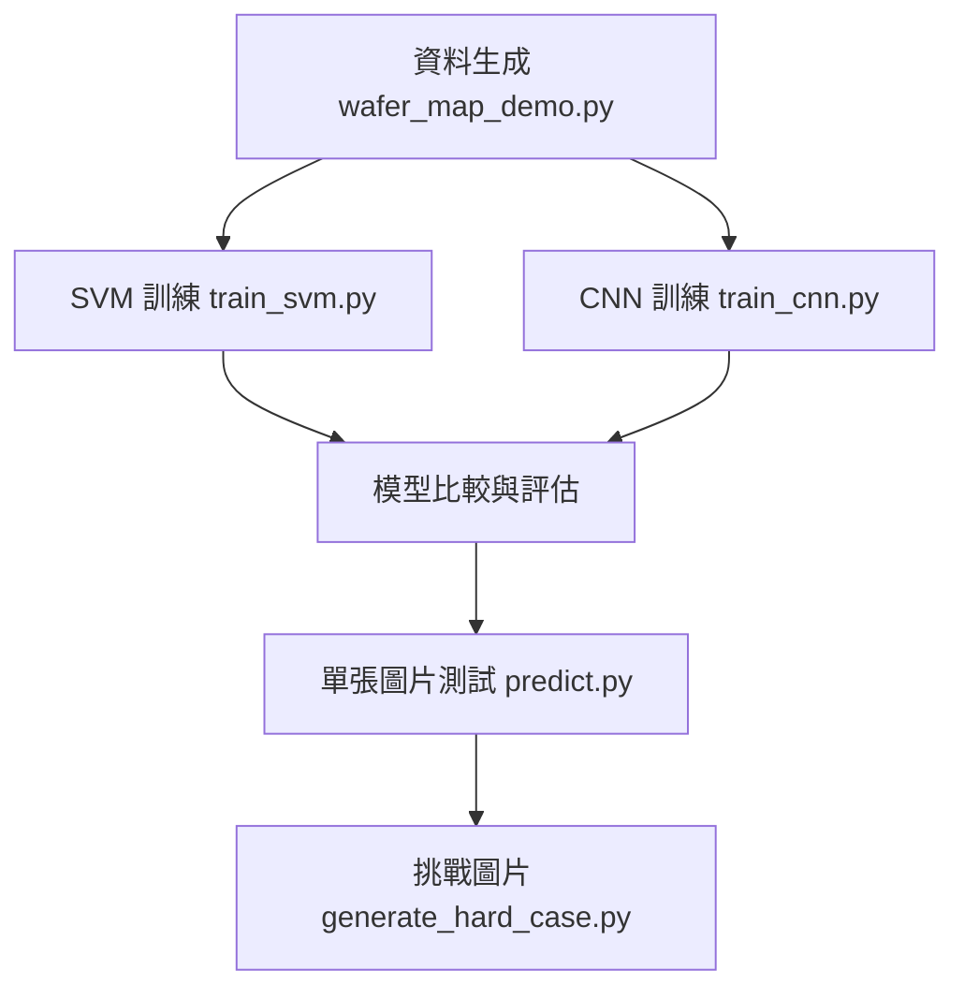
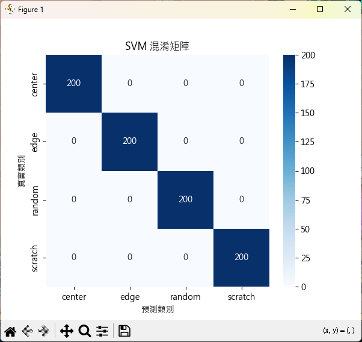
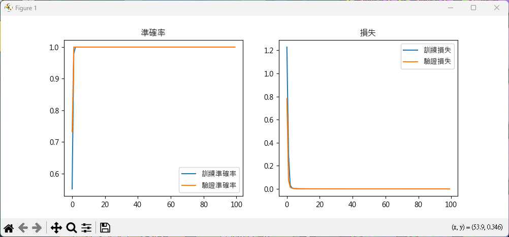
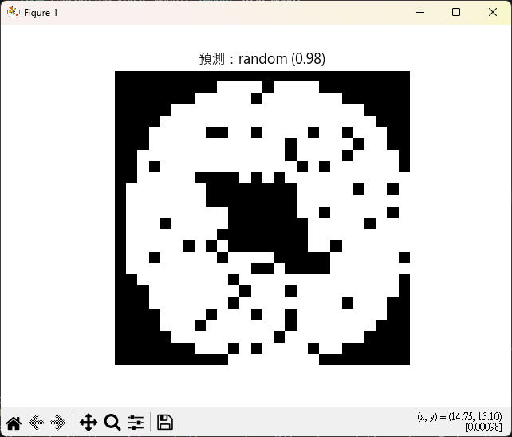

# 🟢 晶圓缺陷檢測模擬專案

## 📌 專案簡介
本專案模擬半導體製程中常見的晶圓缺陷（`Edge`, `Center`, `Scratch`, `Random`），  
並建立 **傳統機器學習模型 (SVM)** 與 **深度學習模型 (CNN)** 進行分類與檢測，最後透過難度較高的挑戰圖片觀察模型表現。

---

## 🎯 專案目標
- ✅ 自動生成模擬晶圓缺陷資料集  
- ✅ 訓練 SVM 與 CNN 兩種模型進行分類  
- ✅ 比較傳統機器學習與深度學習的效果  
- ✅ 測試模型在「高難度缺陷圖」上的信心度表現  

---

## 🗂️ 資料集
- 總數：**4000 張 wafer 圖片**（四類缺陷，各 1000 張）  
- 影像大小：**26x26**，灰階圖  
- `labels.csv`：包含圖片對應的標籤  

### 資料集結構
dataset/
├── images/
│ ├── center/
│ ├── edge/
│ ├── random/
│ ├── scratch/
└── labels.csv

---

## ⚙️ 方法流程

## 📊 結果展示

### 1. SVM 混淆矩陣

測試集準確率：**1.00**

在四類缺陷上皆能穩定辨識

---

### 2. CNN 訓練過程

測試集準確率：**1.00**

CNN 學習效果更好，能捕捉更複雜的圖案

---

### 3. 單張圖片測試

預測類別：**Scratch**

模型信心度：**0.98**

---

🚀 執行方式

生成資料集

python wafer_map_demo.py

訓練模型

傳統 SVM：

python train_svm.py

深度學習 CNN：

python train_cnn.py

單張圖片測試

python predict.py

挑戰圖片測試

python generate_hard_case.py
python predict.py

💡 心得與收穫

SVM 在簡單數據上表現良好，適合快速驗證。

CNN 具備更高的準確率與泛化能力，能捕捉到隱藏模式。

挑戰圖片測試顯示模型會出現低信心預測，強調資料增強與真實數據的重要性。

本專案展示了完整流程：資料生成 → 模型訓練 → 測試 → 結果視覺化

🔮 延伸應用

半導體製程晶圓缺陷檢測

工業產品瑕疵檢測（螺絲、PCB、零件）

醫療影像分類（細胞病變、X-ray 判讀）

AI 品質檢驗自動化系統

📌 作者：HSUEH
📅 2025
